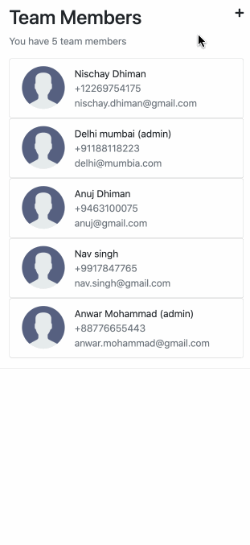
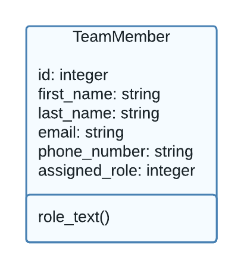
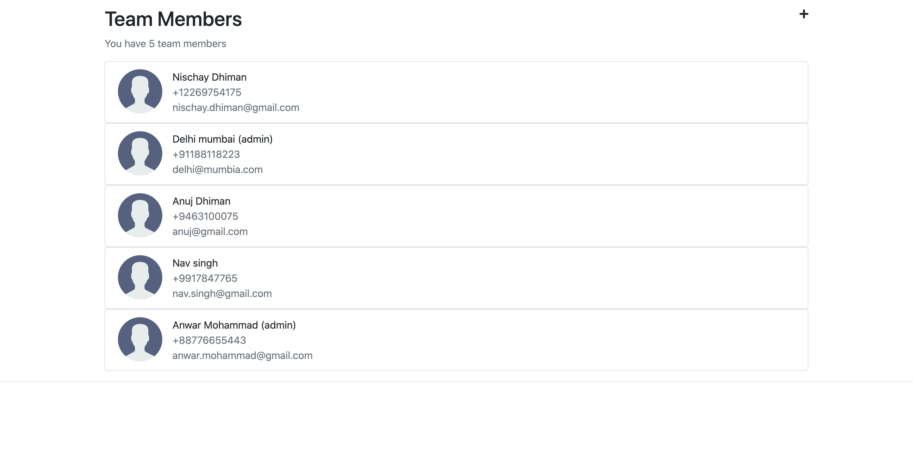

# Instawork Assignment
## _Full Stack Project_


- [Requirements](#requirements)
- [Working Demo](#wokring-demo)
- [Tech Stack](#tech-stack)
- [Project Architecture](#project-architecture)
- [Local Machine Setup](#local-machine-setup)
    - [Python & Pip Installation](#local-machine-setup)
    - [Installing virtualenv](#local-machine-setup)
    - [Cloning the repository](#local-machine-setup)
    - [Activating the virtual env](#local-machine-setup)
    - [Installing all the required libraries and dependencies](#local-machine-setup)
    - [Migrating tables for the first time](#local-machine-setup)
    - [Running the server on local](local-machine-setup)
- [Future Scope](#future-scope)

## Requirements
- Webapp should have list of all team members 
- Webapp should allow adding new team members
- Webapp should allow editing existing team members
- Webapp should allow deleting existing team members

## Working Demo


## Tech Stack

Important libraries and frameworks used in this project:

- [Python](https://www.python.org/) - _3.8.10_, Interpreted object-oriented programming language
- [Django](https://www.djangoproject.com/) - _3.2.8_, High-level Python web framework that encourages rapid development and clean, pragmatic design
- [SQLite](https://www.sqlite.org/index.html) - _1.4.2_, In-built Light Weight Database
- [gunicorn](https://gunicorn.org/) - Python WSGI HTTP Server for UNIX

## Project Architecture

The Project mainly contains single module
- TeamMember
    - Contains first and last name information
    - Contains email information
    - Contains phone number information
    - Contains information about assigned rol

#### DB architecture:

    

## Local Machine Setup

### Step 1:
##### Python and Pip Installation

You may have python preinstalled. To verify other python requirements Installation, Run:
```sh
sudo apt-get install python3-pip python3-dev
```

### Step 2:
Installing virtualenv:
```sh
sudo -H pip install virtualenv
```

### Step 3:
Cloning the repository:
```sh
git clone https://github.com/nischay-dhiman/instawork_assignment.git
cd instawork_assignment
```

### Step 4:
Activating the virtual env:
```shell
virtualenv InstaworkAssignment
source InstaworkAssignment/bin/activate
```

### Step 5:
Installing all the required libraries and dependencies
```sh
pip install -r requirements.txt
```

### Step 6:
Migrating tables for the first time
```sh
python manage.py migrate
```

### Step 7:
Running the server on local
```sh
python manage.py runserver 0.0.0.0:8000
```
We can check website on our local machine browser:
```
http://0.0.0.0:8000/
```
We should see something like this in the browser:



## Future Scope
- Search filter for Team Members
- Pagination for Team Members
- Login for Team members
- Profile Image add for Team members
- Document sharing or Chat application for each member
- Creating Groups of Team members
